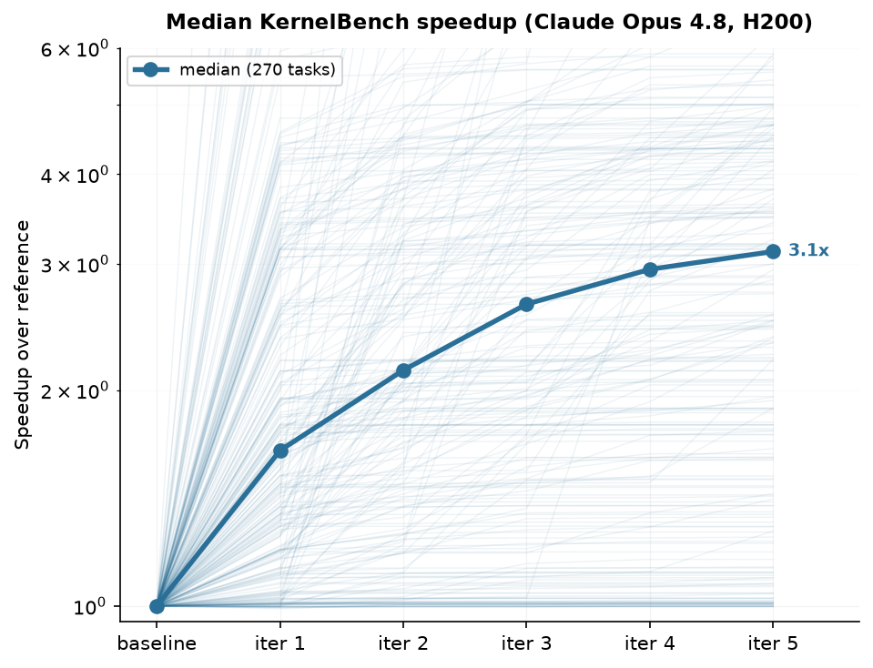

# KernelBench Results

This directory contains the compact aggregate for an AutoHelix run over all 270
KernelBench tasks.

## Headline

- Model: Claude Opus 4.8
- Hardware: NVIDIA H200
- Optimization budget: five iterations per task
- Final median best-so-far speedup: **3.12×**
- Attempts: 1,350 total; 1,347 accepted and three benchmark-gate rejections

Median best-so-far progression:

```text
baseline  iter 1  iter 2  iter 3  iter 4  iter 5
1.00×     1.65×   2.13×   2.64×   2.95×   3.12×
```



## Methodology

Each task starts with a correct passthrough implementation and asks the agent to
produce a faster `ModelNew` while preserving the reference module's constructor
and forward output. The evaluator checks correctness over seeded trials and
measures mean CUDA-event runtime using fixed inputs and a cold-cache protocol.
Static and runtime checks reject evaluator tampering, output caching, timing
manipulation, and asymmetric precision settings.

The original distributed run contained infrastructure failures, including
unavailable GPUs, expired credentials, and an invalid Level 4 harness. The
corrected aggregate replaced affected tasks with fresh five-iteration runs.
It does not treat infrastructure failures as low benchmark scores.

The run used the KernelBench scaffold lineage at commit `cfb9adf`. The current
example adds stricter validation for structured outputs while retaining the
same fixed-input timing metric.

## Files

- `results.json` — per-task iteration metrics, best-so-far values, cost, and
  wall-clock duration.
- `make_progression_plot.py` — regenerates the median progression figure.

To regenerate the plot:

```bash
python -m pip install matplotlib numpy
python results/kernelbench/make_progression_plot.py
```

Raw agent logs and task worktrees are not included because they are large and
are not needed to reproduce the aggregate figures from `results.json`.
